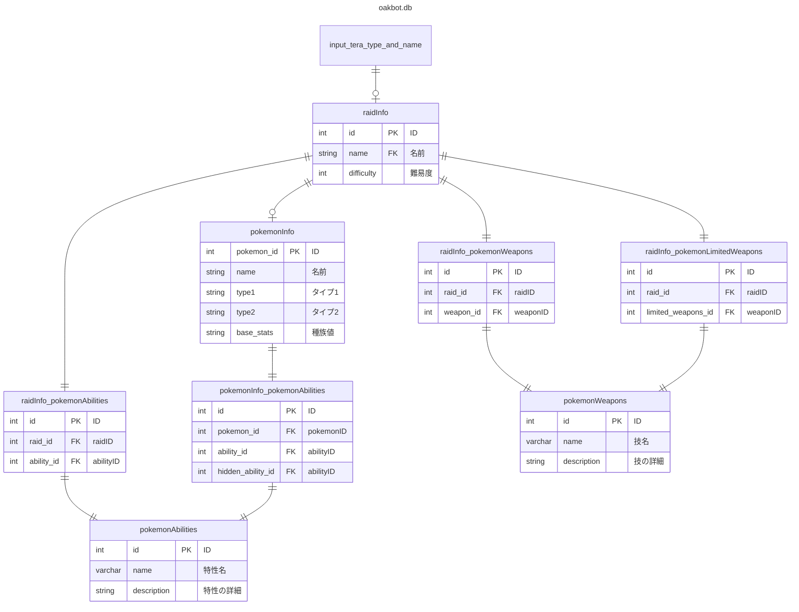

# ER図

## tweetデータベース

```mermaid
---
title: "oakbot.db"
---
erDiagram
    input_tera_type_and_name            ||--o| raidInfo                     : ""
    raidInfo                            ||--o| pokemonInfo                  : ""
    raidInfo                            ||--|| raidInfo_pokemonAbilities    : ""
    raidInfo_pokemonAbilities           ||--|| pokemonAbilities             : ""
    pokemonInfo                         ||--|| pokemonInfo_pokemonAbilities : ""
    pokemonInfo_pokemonAbilities        ||--|| pokemonAbilities             : ""
    raidInfo                            ||--|| raidInfo_pokemonWeapons      : ""
    raidInfo_pokemonWeapons             ||--|| pokemonWeapons               : ""
    raidInfo                            ||--|| raidInfo_pokemonLimitedWeapons      : ""
    raidInfo_pokemonLimitedWeapons      ||--|| pokemonWeapons               : ""

    raidInfo {
        int    id                       PK    "ID"
        string name                     FK    "名前"
        int    difficulty                     "難易度"
    }

    pokemonInfo {
        int    pokemon_id               PK    "ID"
        string name                           "名前"
        string type1                          "タイプ1"
        string type2                          "タイプ2"
        string base_stats                     "種族値"
    }

    pokemonAbilities {
        int     id                      PK    "ID"
        varchar name                          "特性名"
        string  description                   "特性の詳細"
    }

    pokemonWeapons {
        int     id                      PK    "ID"
        varchar name                          "技名"
        string  description                   "技の詳細"
    }

    raidInfo_pokemonAbilities{
        int id                PK "ID"
        int raid_id           FK "raidID"
        int ability_id        FK "abilityID"
    }

    pokemonInfo_pokemonAbilities{
        int id                PK "ID"
        int pokemon_id        FK "pokemonID"
        int ability_id        FK "abilityID"
        int hidden_ability_id FK "abilityID"
    }

    raidInfo_pokemonWeapons{
        int id                  PK "ID"
        int raid_id             FK "raidID"
        int weapon_id           FK "weaponID"
    }

    raidInfo_pokemonLimitedWeapons{
        int id                  PK "ID"
        int raid_id             FK "raidID"
        int limited_weapons_id  FK "weaponID"
    }
```