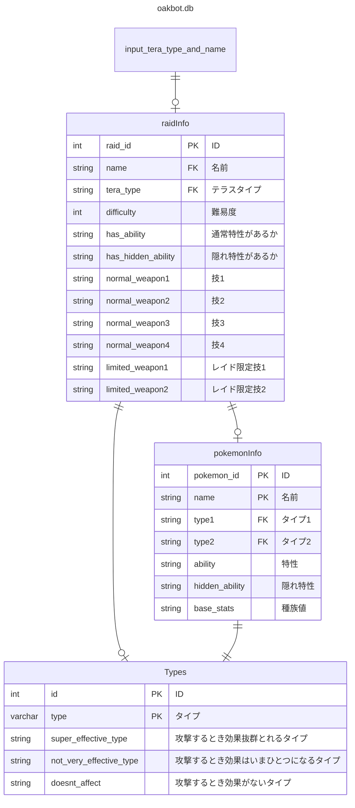

# ER図

## tweetデータベース

```mermaid
---
title: "oakbot.db"
---
erDiagram
    input_tera_type_and_name ||--o| raidInfo    : ""
    raidInfo                 ||--o| pokemonInfo : ""
    raidInfo                 ||--o| Types       : ""
    pokemonInfo              ||--|| Types       : ""

    raidInfo {
        int    raid_id                  PK    "ID"
        string name                     FK    "名前"
        string tera_type                FK    "テラスタイプ"
        int    difficulty                     "難易度"
        string has_ability                    "通常特性があるか"
        string has_hidden_ability             "隠れ特性があるか"
        string normal_weapon1                 "技1"
        string normal_weapon2                 "技2"
        string normal_weapon3                 "技3"
        string normal_weapon4                 "技4"
        string limited_weapon1                "レイド限定技1"
        string limited_weapon2                "レイド限定技2"
    }

    pokemonInfo {
        int pokemon_id                  PK    "ID"
        string name                     PK    "名前"
        string type1                    FK    "タイプ1"
        string type2                    FK    "タイプ2"
        string ability                        "特性"
        string hidden_ability                 "隠れ特性"
        string  base_stats                    "種族値"
    }

    Types {
        int id                          PK    "ID"
        varchar type                    PK    "タイプ"
        string super_effective_type           "攻撃するとき効果抜群とれるタイプ"
        string not_very_effective_type        "攻撃するとき効果はいまひとつになるタイプ"
        string doesnt_affect                  "攻撃するとき効果がないタイプ"
    }
```