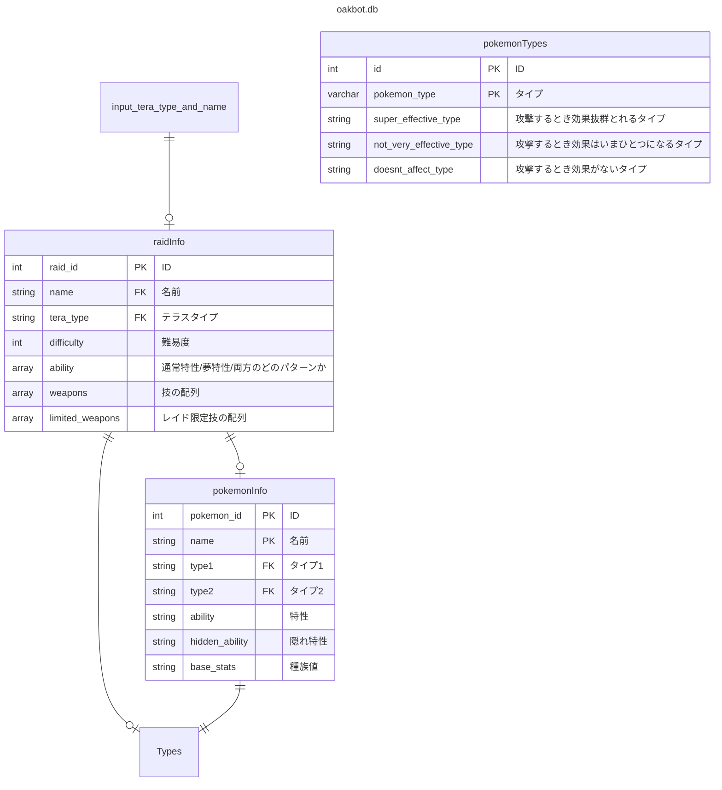

# ER図

## tweetデータベース

```mermaid
---
title: "oakbot.db"
---
erDiagram
    input_tera_type_and_name ||--o| raidInfo    : ""
    raidInfo                 ||--o| pokemonInfo : ""
    raidInfo                 ||--o| Types       : ""
    pokemonInfo              ||--|| Types       : ""

    raidInfo {
        int    raid_id                  PK    "ID"
        string name                     FK    "名前"
        string tera_type                FK    "テラスタイプ"
        int    difficulty                     "難易度"
        array  ability                        "通常特性/夢特性/両方のどのパターンか"
        array  weapons                        "技の配列"
        array  limited_weapons                "レイド限定技の配列"
    }

    pokemonInfo {
        int    pokemon_id               PK    "ID"
        string name                     PK    "名前"
        string type1                    FK    "タイプ1"
        string type2                    FK    "タイプ2"
        string ability                        "特性"
        string hidden_ability                 "隠れ特性"
        string base_stats                     "種族値"
    }

    pokemonTypes {
        int     id                      PK    "ID"
        varchar pokemon_type            PK    "タイプ"
        string  super_effective_type           "攻撃するとき効果抜群とれるタイプ"
        string  not_very_effective_type        "攻撃するとき効果はいまひとつになるタイプ"
        string  doesnt_affect_type             "攻撃するとき効果がないタイプ"
    }
```